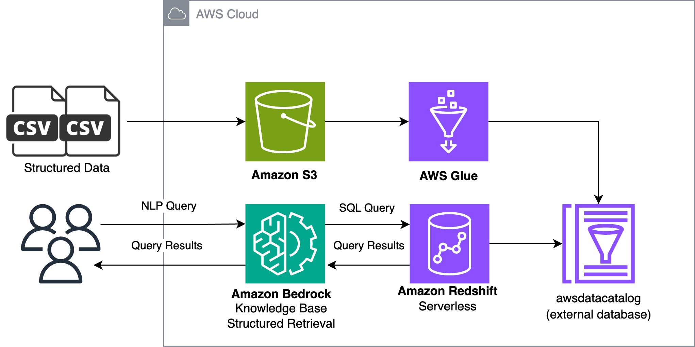

# 정형 데이터 실습하기 🗄️

Bedrock Knowledge Bases with Structured Retrieval 실습에서는 정형 데이터를 s3 버킷에 업로드한 뒤, 이를 Glue와 Redshift를 활용하여 조회합니다. 이후, Bedrock Knowledge Bases를 활용하여 해당 데이터를 참고하여 자연어 쿼리를 SQL 쿼리로 변환하는 작업을 거칩니다. 최종적으로, 이를 통해 원하는 데이터를 조회할 수 있는 과정을 소개합니다.

