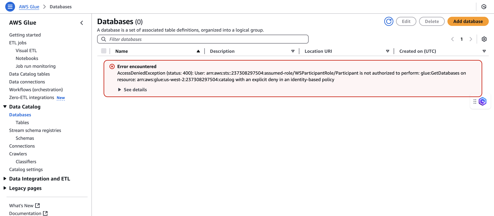
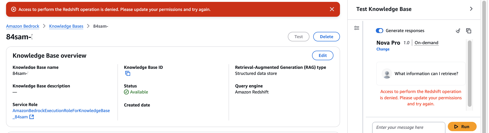
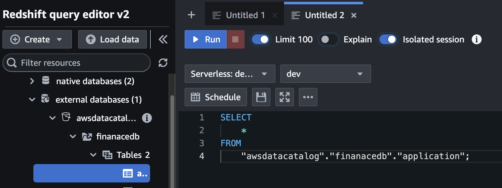
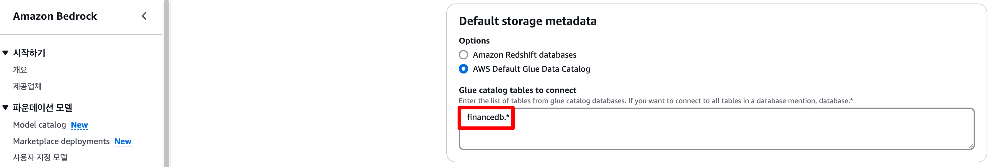
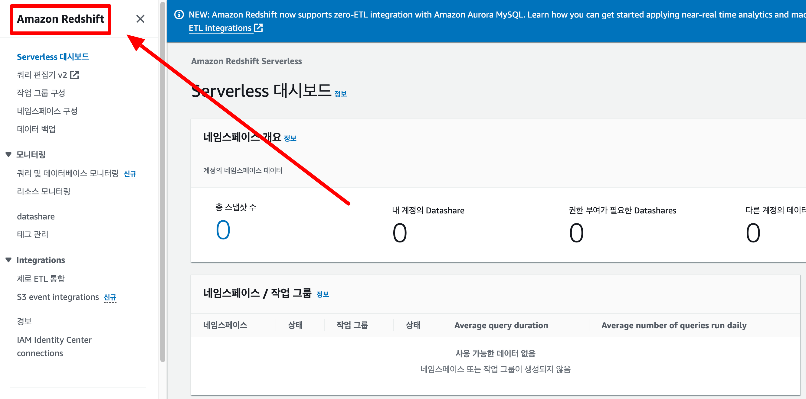

# QnA 

## 생성 권한 문제: AccessDeniedException  

다음과 같이 `AccessDeniedException`이 발생할 경우, IAM Permissions에서 권한이 막혀있는 경우입니다. 참가자는 IAM 권한 수정이 불가하기에 다음과 같은 방안을 시도해볼 수 있습니다:

1. 리전 오류: 실습환경에서 준비하고 허가해드린 확경들은 `us-east-1`과 `us-west-2`인만큼, `ap-northeast-2 (서울)` 등의 리전으로 설정되어 있으면 권한이 막혀 있을 수 있습니다.  
2. 리전이 `us-east-1` 또는 `us-west-2`임에도 불구하고 접근이 안 되면 예비 계정으로 새로 시도해보시는것을 권장드립니다.



## 동기화 실패 오류: Sync failed for data source

해당 오류는 다양한 원인으로 발생할 수 있지만, 권한 문제일 가능성이 매우 높습니다. 이 때문에, 다음 순서로 하나씩 디버깅을 시도해보시는걸 추천드립니다.



### Redshift Query Editor v2 권한 관련 오류

실습에서 [다음 명령어들을 추가하여 권한을 부여하는 과정에서](https://stem.awskorea.kr/docs/Structured/structured_setup_guide#6-redshift-query-editor-v2-db-permissions) 본인의 Knowledge Base IAMR에 오타가 발생 했을 가능성이 있습니다.

예시로, `AmazonBedrockExecutionRoleForKnowledgeBase_abcd1`인 IAMR 대신 `AAmazonBedrockExecutionRoleForKnowledgeBase_abcd11` 등이 추가되어 권한 접근이 안되고 있을 가능성도 있습니다.  

이런 가능성을 배제하기 위해서 복사 붙여놓기 통해 오타의 가능성을 줄이고 다시 시도해보시는 것을 추천드립니다.

또한, 제공해드린 명령어 **두 개 모두** IAMR을 변경해주셔야 하는 점 유의해주시길 바랍니다.

**1. 유저 생성 명령어**  
```
CREATE USER "IAMR:AmazonBedrockExecutionRoleForKnowledgeBase_YOURROLENAME" WITH PASSWORD DISABLE;
```

**2. 권한 부여 명령어**  
```
GRANT USAGE ON DATABASE "awsdatacatalog" TO "IAMR:AmazonBedrockExecutionRoleForKnowledgeBase_YOURROLENAME";
```

### IAM Permission  

또한, IAM 권한을 부여하면서 문제가 생겼을 가능성이 있습니다. 저장이 제대로 되지 않았을 가능성도 있으며, 특정 권한이 누락 되었을 수도 있습니다. 이 때문에 [**IAM 설정 관련 부분**](https://stem.awskorea.kr/docs/Structured/structured_setup_guide#5-iam-role-permissions)도 다시 한번 확인해보시는걸 추천드립니다.


특히, 다음 권한들이 모두 있는지 확인해주시길 바랍니다.  

  


### Knowledge Base AWS Glue Catalog 권한 오류

위 단계 모두 거쳤음에도 불구하고 오류가 계속해서 발생한다면 다음과 같이 DB 명을 잘못 기입한 오류일 수도 있습니다. 보시면 `financedb.*`라고 권한을 주었으나, 실제 Glue DB는 오타로 인하여 finan`a`ce라고 생성되었습니다. 따라서 권한이 잘못 부여 되었기 때문에, `finanacedb.*`라고 오타까지 고려해서 Knowledge Base를 생성하시면 권한이 정상적으로 부여됩니다.


  
  

### Redshift 권한 관련 오류

만약에 다음과 같은 오류가 발생하시면, Redshift부터 권한이 없을 가능성이 존재합니다. 해당 오류는 높은 확률로 `Default Redshift Serverless Namespace`와 `Workgroup`을 생성하시면서 S3 권한을 부여하지 않았기에 발생할 가능성이 높습니다. 해당 문제를 해결하기 위해서는 Namespace와 Workgroup 모두 삭제하시고, 다시 생성하셔야 합니다. 해당 작업은 [**이 부분**](https://stem.awskorea.kr/docs/Structured/structured_setup_guide#3-redshift-workgroupnamespace)을 참고하시면 됩니다. 

  

이때, 삭제하셨다가 만약에 default workgroup을 조회하시는 법을 못 찾고 계시면 다음을 누르시면 됩니다.  

  


### 기타  
흔히 발생할 수 있는 문제들은 위 작업들을 수행하면 보통 해결되긴 하지만, 이외에도 다양한 문제들이 발생할 수 있습니다. 그럴 때마다 당황하지 마시고 도움을 요청하시면 바로 찾아가서 도와드리도록 하겠습니다.  