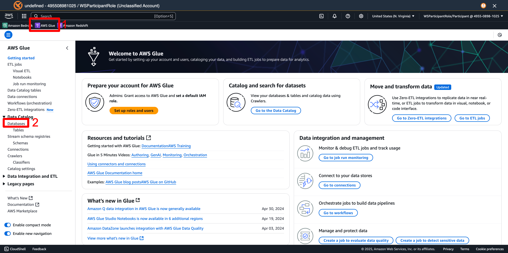
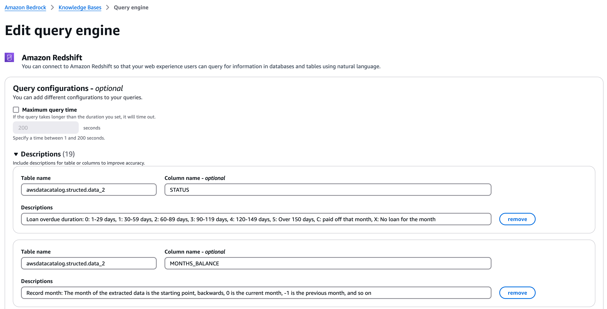

# 실습 ① - BKB Structured Retrieval

## 1. [S3] Upload Dataset

a. S3 버킷을 생성합니다.   
이때 주의해야 할 점으로는 S3 버킷은 고유 이름이 필요하기 때문에 같은 이름을 사용하실 경우 생성이 안 될 수   도 있습니다. 따라서, 생성이 안 된다면 이름을 다르게 해보시는 걸 추천해 드립니다.  
  
  
  


b. 제공받은 csv 파일을 업로드합니다.


b1. `application` 폴더와 `credit` 폴더를 각각 생성해 줍니다. 이는 두개 csv의 스키마 차이를 구분하기 위해서입니다.  
  
  
  
  

b2. `application` 폴더에는 `application.csv` 파일을 업로드합니다.  

   
   
  


위 과정을 똑같이 `credit` 폴더에 들어가서 `credit.csv` 업로드합니다.


모든 과정을 무사히 마쳤을 시, `application` 폴더에는 `application.csv`가 있어야 하며, `credit` 폴더에는 `credit.csv`가 있어야 합니다.  


## 2. [Glue] Create DB, Crawler

a. Glue Database를 생성합니다.

a1. AWS Glue를 검색해서 콘솔으로 간 후, 왼쪽 사이드바에 `Databases`를 선택합니다.
  

a2. `financedb` Glue DB를 생성합니다.  
  


b. Glue Crawler을 생성하여 S3 버킷으로부터 데이터를 DB에 테이블로 넣어줍니다.  

b1. 왼쪽 사이드바에서 `Crawlers`를 선택합니다.  
    

b2. `Create Crawler` 선택합니다.  
  

b3. `financecrawler`를 생성합니다.  
  
  
    
   
  
  
   
   
   
   
   

b4. `Run crawler`를 실행합니다.


## 3. [Redshift] Workgroup/Namespace

a. Workgroup과 Namespace를 생성합니다.  

a1. s3 버킷이 접근 가능한 IAM role을 생성합니다.  

   
   
   
  

다음과 같이 생성이 완료됩니다. 만약 Namespaces/Workgroups에서 안 보이신다면 설정 중이기 때문에 조금 기다린 뒤에 새로고침 해보시면 나타나는 것을 확인해볼 수 있습니다.   

   


## 4. [Knowledge Base] Structured KB  

a. Structured Knowledge Base를 생성합니다.

a1. Redshift Default Workgroup을 선택합니다.  
   
   
  
  

a2. Default storage metadata를 AWS Default Glue Data Catalog로 변경한 뒤, 연결할 Glue catalog table 추가해야 합니다. 이때, 본인의 Glue Data Table을 포함하고 있는 DB 명을 알아보는 방법은 다음과 같습니다.  


a2-1. Redshift로 돌아가서 Query Data를 선택합니다. 이후, Redshift Query Editor v2에서 `awsdatacatalog` 아래에 위치한 본인의 DB 명을 알아봅니다. 이는 보통 이전에 설정한 Glue DB 명이랑 동일합니다.

  
  
  
  

a3. `Glue catalog tables to connect`에서 `{본인DB}.*`을 작성합니다. 예시의 경우에는 `financedb.*`으로 작성하여, financedb 아래에 있는 모든 테이블들을 연결하겠다는 뜻입니다.

  

a4. Knowledge Base를 생성합니다.  

  


## 5. [IAM] Role Permissions

a. IAM 권한들을 추가합니다.  

  
  
  

아래 권한들을 Statement에 추가하면 됩니다. 즉, 이미 있는 Sid들 이후에 추가하면 됩니다.

```yaml
        {
            "Sid": "VisualEditor0",
            "Effect": "Allow",
            "Action": [
                "glue:GetDatabases",
                "glue:GetDatabase",
                "glue:GetTables",
                "glue:GetTable",
                "glue:GetPartitions",
                "glue:GetPartition",
                "glue:SearchTables"
            ],
            "Resource": "*"
        },
        {
            "Sid": "Statement1",
            "Effect": "Allow",
            "Action": [
                "s3:ListBucket",
                "s3:GetObject"
            ],
            "Resource": "*"
        },
        {
            "Sid": "Statement2",
            "Effect": "Allow",
            "Action": [
                "lakeformation:GetDataAccess",
                "lakeformation:GrantPermissions"
            ],
            "Resource": "*"
        }
```

  
  


## 6. [Redshift Query Editor v2] DB Permissions

a. Redshift Query Editor v2에서 다음 명령어들을 추가하여 권한을 부여합니다.  
이때, IAMR 위치에 본인의 KnowledgeBase IAMR을 추가하면 됩니다.  

```
CREATE USER "IAMR:AmazonBedrockExecutionRoleForKnowledgeBase_YOURROLENAME" WITH PASSWORD DISABLE;

GRANT USAGE ON DATABASE "awsdatacatalog" TO "IAMR:AmazonBedrockExecutionRoleForKnowledgeBase_YOURROLENAME";
```

  
  


# Practice

위의 설정을 다 완료한 뒤 다음 실습을 진행합니다.  

a. Sync 진행합니다.
  


b. Anthropic Claude 3 Sonnet을 선택합니다.  

b1. 이때, 모델 권한이 없을 경우 다음과 같이 신청하면 됩니다.   

  
  
  
  

b2. 이후, 새로고침을 해보시면 Sonnet을 선택할 수 있게 된 것을 확인할 수 있습니다.  

  


c. 데이터를 조회할 수 있는 자연어 쿼리들을 제안합니다.  

예: 가장 높은 연봉은 몇인가요? (What is the max salary?)  

  
 


## 🎁 BONUS: Bedrock Knowledge Base에 Description 추가하기  
Practice에서 질문한 것처럼 테이블에 대한 추가적인 설명 없이도 BKB가 대답을 잘하는 경우가 있습니다. 하지만, 만약 우리가 만족할 만한 대답을 하지 못한다면 어떻게 해야 할까요? </br>  
우리는 BKB가 테이블에 대해 더 잘 이해할 수 있도록 Description을 추가할 수 있습니다.  

a. BKB의 Query Engine을 선택합니다.
 

b. Edit을 눌러 Description configuration 창을 엽니다.


c. 직접 Description을 추가해줍니다. (아래 표를 참고해서 작성해주세요.)
 

## Description Script

| Table name         | Column name           | Descriptions                                                                                      |
|--------------------|-----------------------|---------------------------------------------------------------------------------------------------|
| awsdatacatalog     | STATUS                | Loan overdue duration: 0: 1-29 days, 1: 30-59 days, 2: 60-89 days, 3: 90-119 days, 4: 120-149 days, 5: Over 150 days, C: paid off that month, X: No loan for the month |
| awsdatacatalog     | MONTHS_BALANCE        | Record month: The month of the extracted data is the starting point, backwards, 0 is the current month, -1 is the previous month, and so on |
| awsdatacatalog     | FLAG_OWN_CAR          | Is there a car: 'Y': yes, 'N': no                                                                 |
| awsdatacatalog     | CODE_GENDER           | Gender: 'M': male, 'F': Female                                                                    |
| awsdatacatalog     | NAME_FAMILY_STATUS    | Marital status                                                                                    |
| awsdatacatalog     | DAYS_BIRTH            | Count backwards from current day (0), -1 means yesterday, -365 means 1 year old. (you can get how old is the client by abs(DAYS_BIRTH) / 365) |
| awsdatacatalog     | FLAG_OWN_REALTY         | Is there a property |
| awsdatacatalog     | CNT_CHILDREN            | Number of children |
| awsdatacatalog     | AMT_INCOME_TOTAL            | Annual income |
| awsdatacatalog     | NAME_INCOME_TYPE            | Income category |
| awsdatacatalog     | NAME_EDUCATION_TYPE            | Education level |
| awsdatacatalog     | NAME_HOUSING_TYPE            | Way of living |
| awsdatacatalog     | FLAG_MOBIL            | Is there a mobile phone |
| awsdatacatalog     | FLAG_WORK_PHONE            | Is there a work phone |
| awsdatacatalog     | FLAG_PHONE            | Is there a phone |
| awsdatacatalog     | FLAG_EMAIL            | Is there an email |
| awsdatacatalog     | OCCUPATION_TYPE            | Occupation |
| awsdatacatalog     | CNT_FAM_MEMBERS            | Family size |

</div>
</details>

</div>
</details>