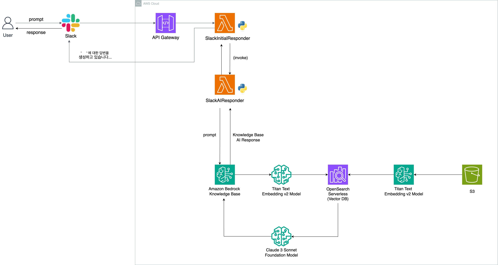

# 비정형 데이터 실습하기 🚀

Bedrock Knowledge Bases를 활용한 Slack Chatbot 만들기 실습에서는 pdf 등의 비정형 데이터를 s3 버킷에 업로드한 뒤, 이를 OpenSearch, API Gateway, Lambda 등을 활용하여 조회합니다. 이후, Bedrock Knowledge Bases를 활용하여 해당 데이터를 참고하여 답변을 반환하며 참고한 자료 또한 첨부합니다. 이를 간단하게 Slack에서 `/ask` 등의 명령어로 구현하여 사용성을 높입니다.

