# 실습 ① -Knowledge Base 세팅하기

---
먼저, 슬랙봇에서 사용할 Knowledge Base를 생성해봅시다.

모든 실습은 us-west-2 (오레곤) 지역에서 합니다.

---

### Step 1: S3 생성하기
비정형 데이터를 보관할 저장소인 S3를 생성하고 파일을 업로드 해봅시다.

[AWS 콘솔](https://us-west-2.console.aws.amazon.com/console/home?region=us-west-2) 좌측 상단에 S3를 검색하여 클릭하거나 [S3 콘솔](https://us-west-2.console.aws.amazon.com/s3/home?region=us-west-2#)에 직접 접속합니다.
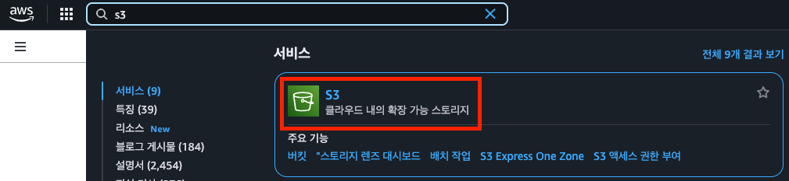

주황색 **버킷 만들기** 버튼을 클릭합니다. 
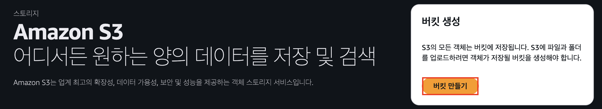

버킷 이름을 설정하고, 다른 설정은 수정하지않고 기본값으로 둔 후 하단의 버킷 만들기를 클릭하여 버킷을 생성해줍니다.
(이때, S3 버킷은 고유 이름이 필요하기 때문에 생성이 되지 않을 경우 이름을 다르게 해보시는 걸 추천해 드립니다.)
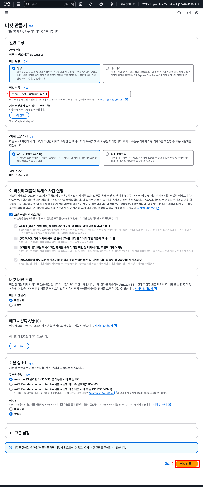

생성된 s3 버킷을 클릭하고 업로드>파일추가>다운받은 파일 클릭하여 업로드해줍니다. 
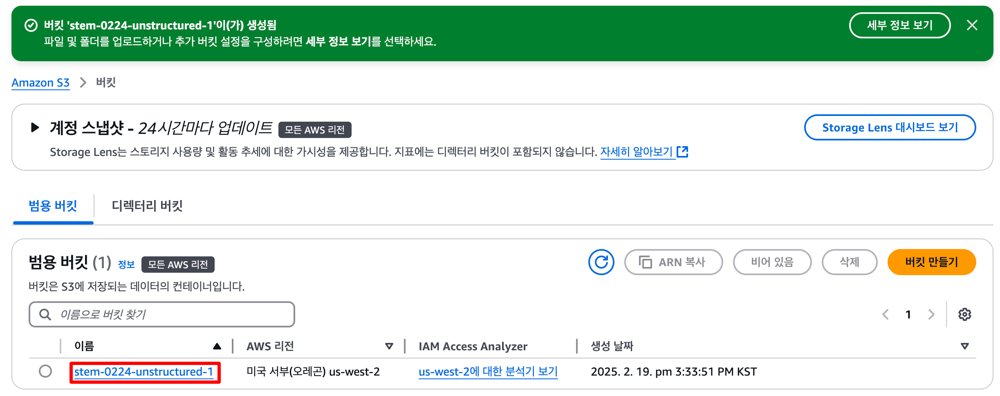

이제 S3 구성은 끝났습니다!
여기에 저장된 데이터들을 기반으로 AI가 대답을 해주게 될것입니다. 

### Step 2: Bedrock Knowledge Base 생성하기
이제 Amazon Bedrock에 S3에 저장된 데이터를 연동할 Knowledge Base를 설정해봅시다.

[AWS 콘솔](https://us-west-2.console.aws.amazon.com/console/home?region=us-west-2) 좌측 상단에 S3를 검색하여 클릭하거나 [Bedrock 콘솔](https://us-west-2.console.aws.amazon.com/bedrock/home?region=us-west-2#/)에 직접 접속합니다.
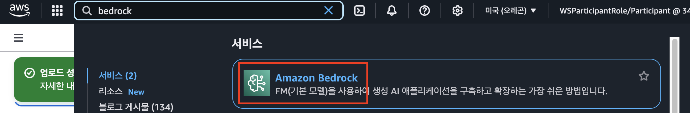

### STEP2.1 모델 액세스 요청하기
KnowledgeBase를 생성하고 사용하기 위해선 우리가 사용할 AI모델에 대한 액세스 권한 요청을 먼저 해야합니다.

좌측 사이드메뉴의 **Bedrock configurations > 모델 액세스** 또는 [여기](https://us-west-2.console.aws.amazon.com/bedrock/home?region=us-west-2#/modelaccess)를 클릭합니다.
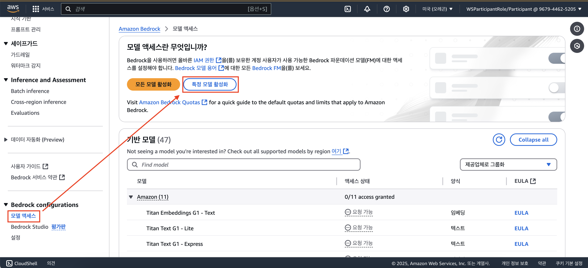

**모델 액세스 권한 수정**을 클릭한 후 원하는 모델 선택해줍니다.

(모델 확정 후 스크린샷 추가 예정)

이번 세션에서는 
- Titan Text Embeddings V2 
- Claude 3.5 Sonnet v1
- Claude 3.5 Sonnet v2 

가 필요합니다.

이제 **다음 > 제출** 버튼을 눌러 액세스를 받을때까지 잠시 기다려주면 액세스가 부여됩니다.

### Step 2.2 Knowledge Base 생성하기
좌측 메뉴에서 "지식 기반" 또는 [여기](https://us-west-2.console.aws.amazon.com/bedrock/home?region=us-west-2#/knowledge-bases)를 클릭한 뒤 

**지식 기반 생성 > Knowledge Base with vectore store** 를 클릭합니다.
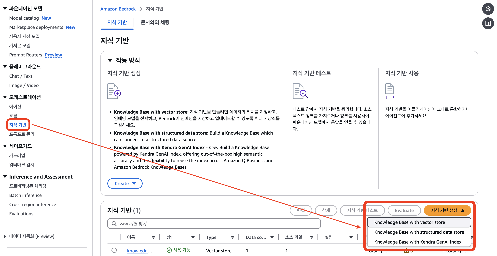

1단계에서는 기본으로 설정된 값들을 사용해주면 됩니다.
아래 설정들이 잘 되어 있는지 확인해주세요.
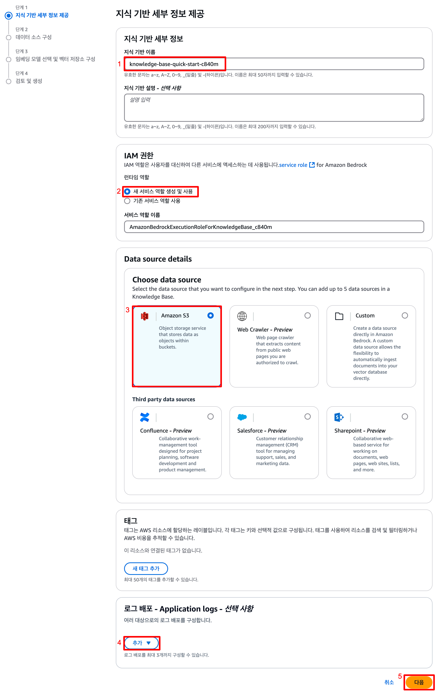
1. 지식 기반 이름 설정
2. IAM 권한 설정 - 새 서비스 역할 생성 및 사용 : 자동으로 필요한 최소 권한이 할당됩니다
3. 데이터 소스 지정 - S3
4. (선택 사항)로그 배포 - **추가 > Amazon CloudWatch Logs로** : 지식 기반에 대한 로그를 CloudWatch 로 확인할 수 있습니다.
5. **다음** 클릭

2단계에서는 데이터 소스를 구성해봅시다. 

STEP1에서 만든 S3를 연결하고, 데이터를 분석할 parser를 AI 모델로 설정해주어야 합니다. 
아래 설정들이 잘 되어 있는지 확인해주세요.
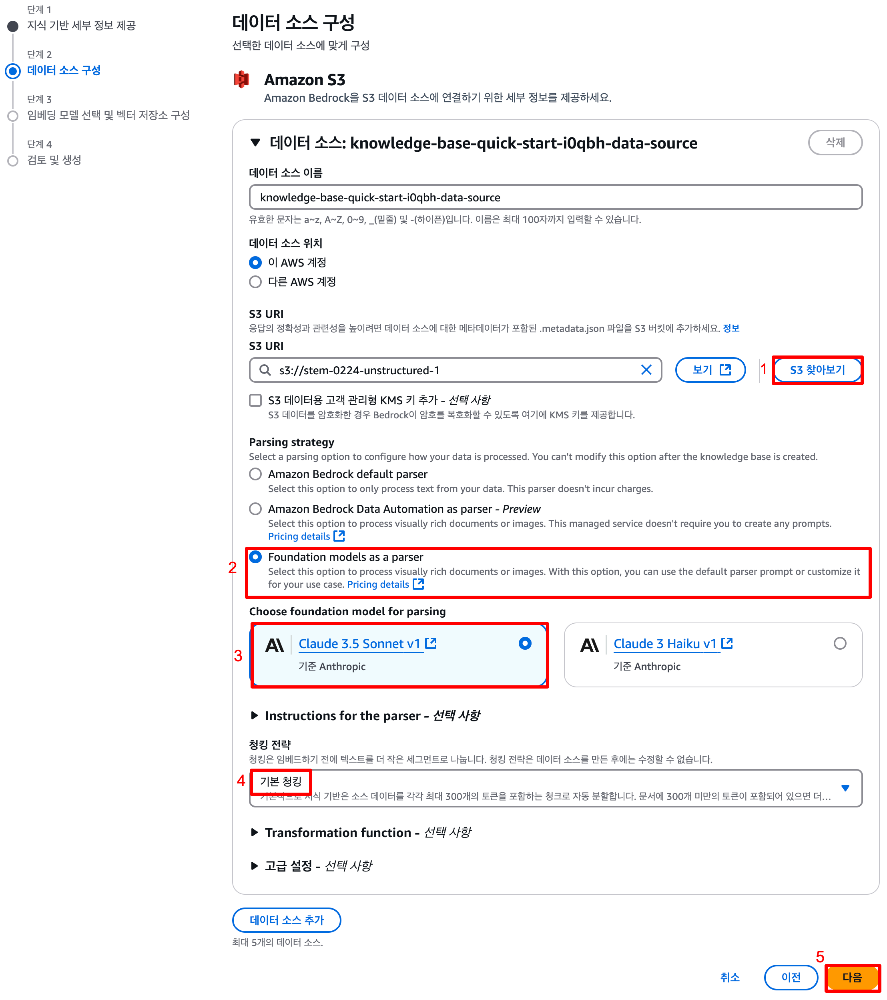
1. S3 URI - **S3 찾아보기** > STEP1에서 생성한 S3 클릭 > 선택
2. Parsing strategy - **Foundation models as a parser** 클릭 
3. **Claude 3.5 Sonnet v1** 클릭
4. 청킹 전략 - **기본 청킹**
5. **다음** 클릭

마지막으로, 임베딩 모델을 선택해줍시다.
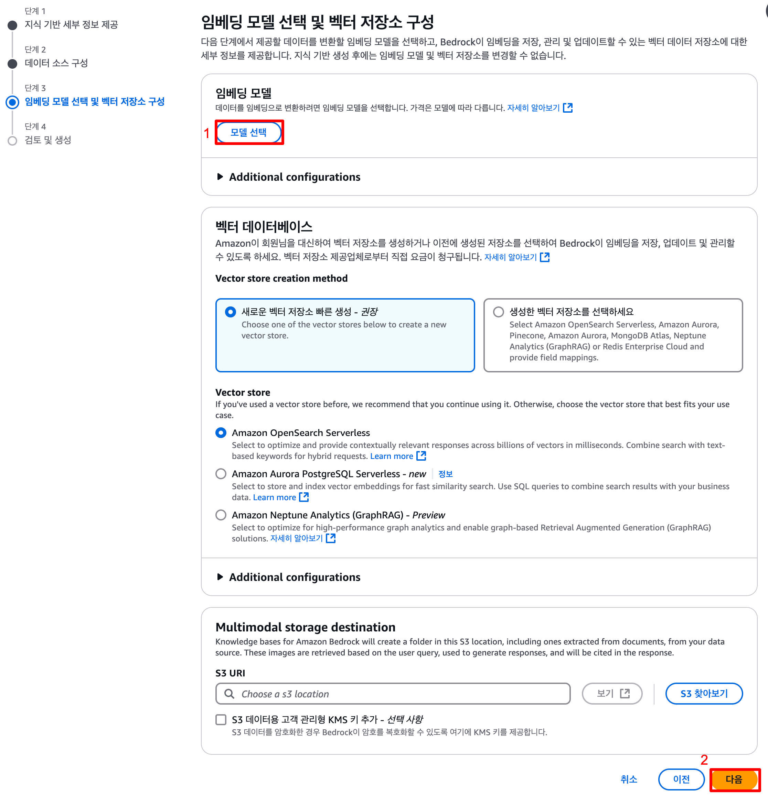

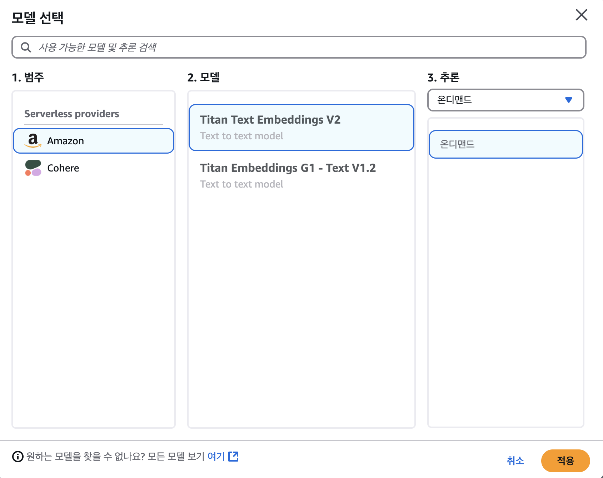
1. 모델 선택 > **Titan Text Embeddings V2** > 적용
2. **다음** 클릭
3. 검토 후 **지식 기반 생성** 클릭

Opensearch를 연동하여 데이터베이스를 생성하는 과정에서 시간이 조금 걸리므로 다음 스텝으로 넘어가서 진행해봅시다.

### STEP2.3 데이터 소스 동기화 및 테스트하기 
지식 기반이 다 생성되고 나면 아래와 같은 화면을 확인하실 수 있습니다. 마지막으로 데이터 소스에서 방금 생성한 지식 기반을 선택하고 동기화를 클릭해주면 준비는 끝납니다!
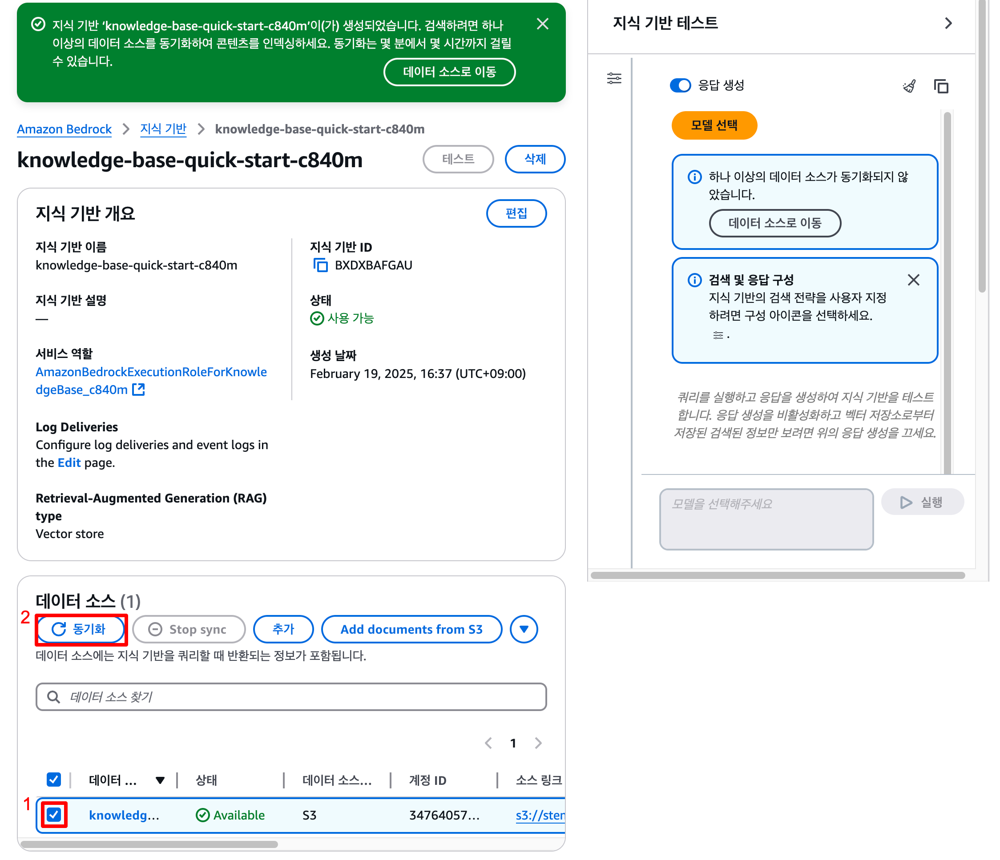

이후 우측의 모델 선택을 클릭해 원하는 모델로 테스트를 해보며 모델별 성능을 비교해볼 수 있습니다.

