# 실습 ① -Knowledge Base 세팅하기 🚀

---
먼저, 슬랙봇에서 사용할 Knowledge Base를 생성해봅시다. 
이 Knowledge Base는 챗봇이 질문에 답변할 때 참고하는 '두뇌' 역할을 하게 됩니다.

⚠️ 모든 실습은 us-west-2 (오레곤) 지역에서 진행합니다.

---

### Step 1: S3 생성하기 📦
비정형 데이터를 보관할 저장소인 S3를 생성하고 파일을 업로드 해봅시다.
여기에 우리의 AI가 학습할 문서들이 저장될 예정입니다.

[AWS 콘솔](https://us-west-2.console.aws.amazon.com/console/home?region=us-west-2) 좌측 상단에 S3를 검색하여 클릭하거나 [S3 콘솔](https://us-west-2.console.aws.amazon.com/s3/home?region=us-west-2#)에 직접 접속합니다.
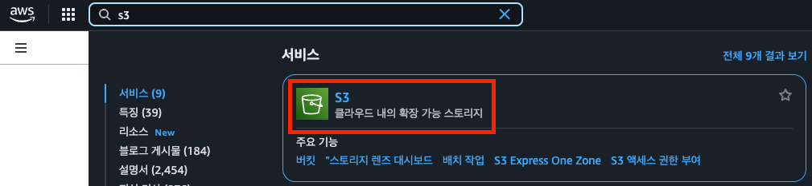

주황색 **버킷 만들기** 버튼을 클릭합니다. 
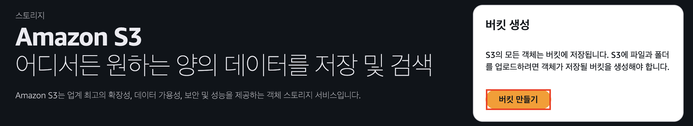

버킷 이름을 설정하고, 다른 설정은 수정하지않고 기본값으로 둔 후 하단의 **버킷 만들기**를 클릭하여 버킷을 생성해줍니다.
💡 Tip: S3 버킷 이름은 전 세계에서 고유해야 합니다. 생성이 안 된다면 다른 이름을 시도해보세요!
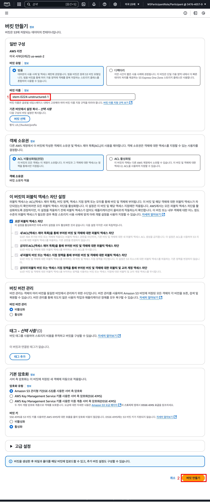

이제 데이터를 업로드해봅시다:

[교육규정.pdf](./data/교육규정.pdf) 를 다운받아 줍니다.

생성된 s3 버킷을 클릭하고 업로드>파일추가>다운받은 파일 클릭하여 업로드해줍니다. 
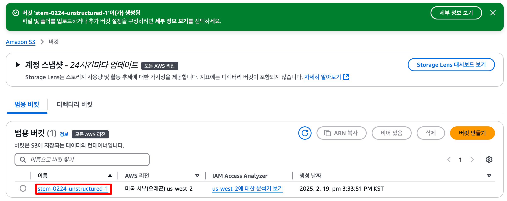

이제 S3 설정은 끝났습니다!
여기에 저장된 데이터들을 기반으로 AI가 대답을 해주게 될것입니다. 

### Step 2: Bedrock Knowledge Base 생성하기 🧠
이제 Amazon Bedrock에 S3에 저장된 데이터를 연동할 Knowledge Base를 설정해봅시다.

[AWS 콘솔](https://us-west-2.console.aws.amazon.com/console/home?region=us-west-2) 좌측 상단에 S3를 검색하여 클릭하거나 [Bedrock 콘솔](https://us-west-2.console.aws.amazon.com/bedrock/home?region=us-west-2#/)에 직접 접속합니다.
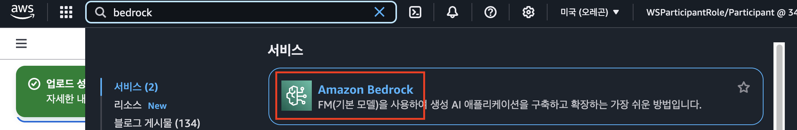

### Step 2.1: 모델 액세스 요청하기 🔐
KnowledgeBase를 생성하고 사용하기 위해선 우리가 사용할 AI모델에 대한 액세스 권한 요청을 먼저 해야합니다.

좌측 사이드메뉴의 **Bedrock configurations > 모델 액세스** 또는 [여기](https://us-west-2.console.aws.amazon.com/bedrock/home?region=us-west-2#/modelaccess)를 클릭합니다.
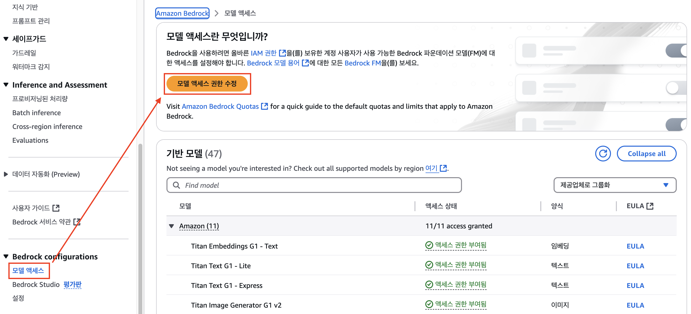

**특정 모델 활성화**를 클릭한 후 원하는 모델 선택해줍니다.

이번 세션에서는 
- 🤖 Titan Text Embeddings V2 
- 🤖 Claude 3.5 Sonnet (또는 Claude 3.5 Sonnet v1)

가 필요합니다.
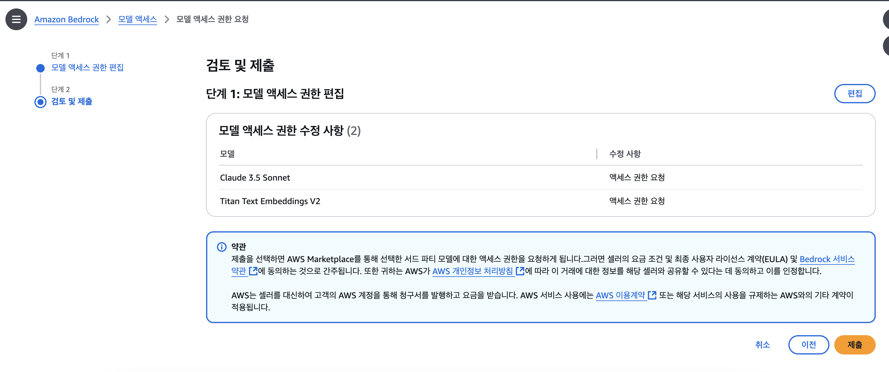

이제 **다음 > 제출** 버튼을 눌러 액세스를 받을때까지 잠시 기다려주면 액세스가 부여됩니다.

### Step 2.2: Knowledge Base 생성하기 📚
좌측 메뉴에서 "지식 기반" 또는 [여기](https://us-west-2.console.aws.amazon.com/bedrock/home?region=us-west-2#/knowledge-bases)를 클릭한 뒤 

**지식 기반 생성 > Knowledge Base with vectore store** 를 클릭합니다.
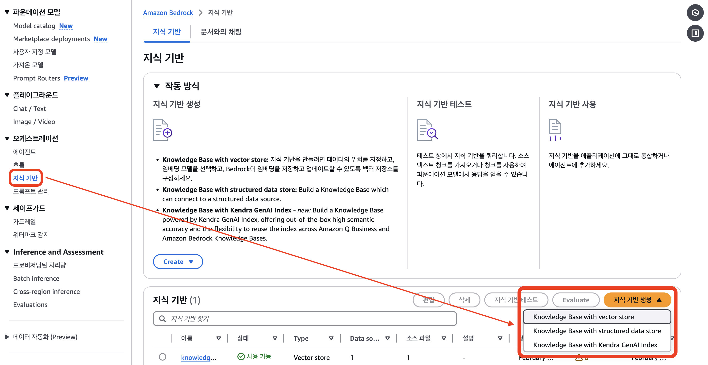

#### 📝 1단계: 기본 설정하기
기본값들을 그대로 사용하되, 아래 설정들이 잘 되어 있는지 확인해주세요:

1. 지식 기반 이름 설정
2. IAM 권한 설정 - 새 서비스 역할 생성 및 사용 : 자동으로 필요한 최소 권한이 할당됩니다
3. 데이터 소스 지정 - S3
4. (선택 사항)로그 배포 - **추가 > Amazon CloudWatch Logs로** : 지식 기반에 대한 로그를 CloudWatch 로 확인할 수 있습니다.
5. **다음** 클릭
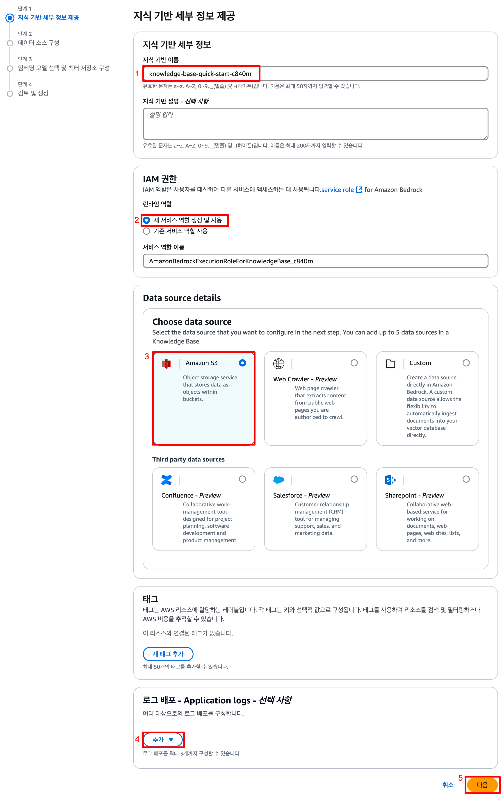

#### 🔧 2단계: 데이터 소스 설정하기
이제 우리의 S3 데이터를 연결하고 AI 파서를 설정해봅시다.

STEP1에서 만든 S3를 연결하고, 데이터를 분석할 parser를 AI 모델로 설정해주어야 합니다. 
아래 설정들이 잘 되어 있는지 확인해주세요:

1. S3 URI - **S3 찾아보기** > STEP1에서 생성한 S3 클릭 > 선택
2. Parsing strategy - **Foundation models as a parser** 클릭 
3. **Claude 3.5 Sonnet v1** 클릭
4. 청킹 전략 - **기본 청킹**
5. **다음** 클릭
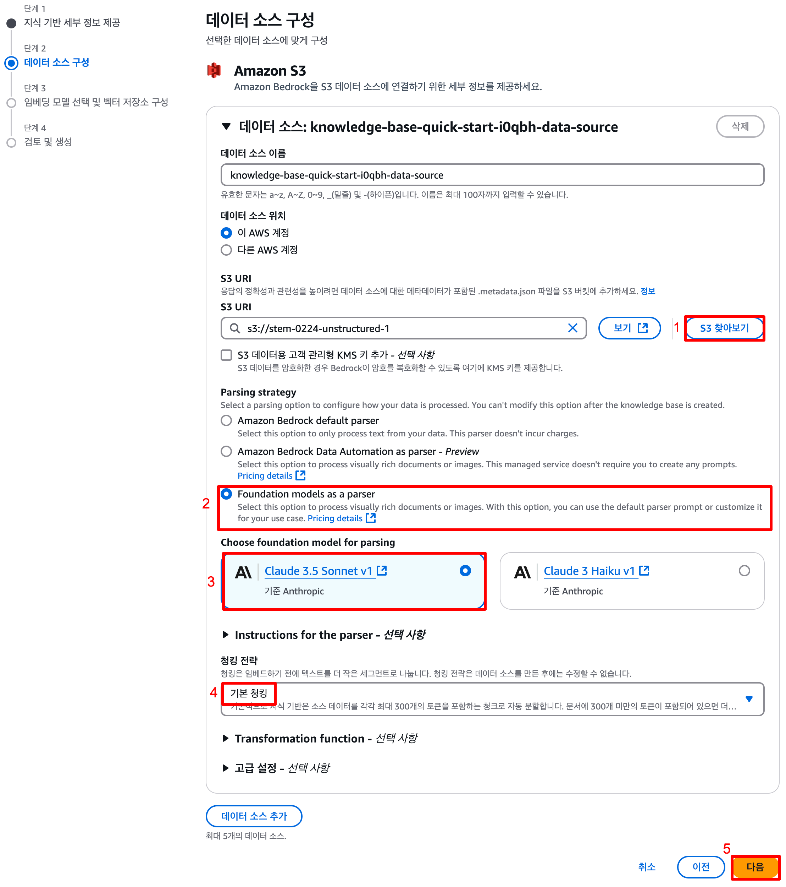

🎯 3단계: 임베딩 모델 선택하기
마지막으로 텍스트를 벡터로 변환해줄 임베딩 모델을 선택해봅시다.
1. 모델 선택 > **Titan Text Embeddings V2** > 적용
2. **다음** 클릭
3. 검토 후 **지식 기반 생성** 클릭
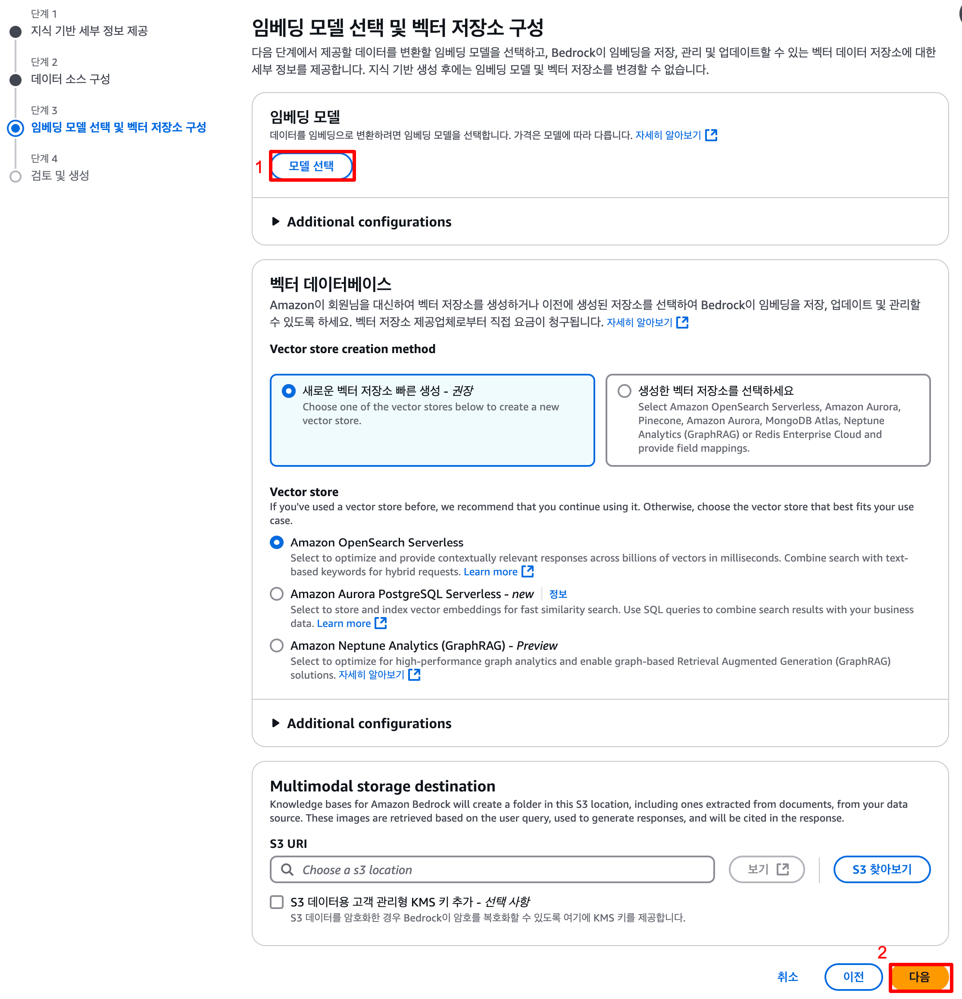

⏳ OpenSearch 연동과 데이터베이스 생성에는 시간이 좀 걸립니다. 조금만 기다려주세요!  
기다리는동안 다음 실습으로 넘어가서 진행해봅시다.

### Step 2.3:  데이터 소스 동기화하고 테스트하기 ✨
지식 기반이 다 생성되고 나면 아래와 같은 화면을 확인하실 수 있습니다. 마지막으로 데이터 소스에서 방금 생성한 지식 기반을 선택하고 동기화를 클릭해주면 준비는 끝납니다!
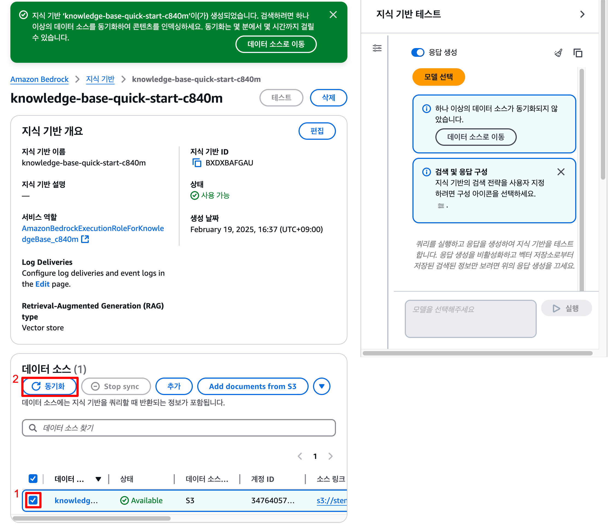

이후 우측의 모델 선택을 클릭해 원하는 모델로 테스트를 해보며 모델별 성능을 비교해볼 수 있습니다.

💡 **Tip:** 생성이 완료되면 :key: **지식 기반 ID**를 복사해둡니다. 이는 실습 ②에서 람다 함수 생성시 사용할 예정입니다.

🎉 축하합니다! 이제 Knowledge Base 설정이 완료되었습니다. 
다음 실습에서는 이 Knowledge Base를 활용하는 멋진 슬랙봇을 만들어봅시다!

