# 실습 ② - Slack 챗봇 만들기

--- 
이제 앞서 만든 Knowledge Base를 활용하는 Slack 챗봇을 만들어봅시다.

모든 실습은 us-west-2 (오레곤) 지역에서 진행합니다.

---

### STEP1 Slack Workspace 생성하기
먼저, 우리가 만들 슬랙봇이 동작할 워크스페이스를 준비해봅시다.
기존 워크스페이스를 사용하셔도 되고, 새로 생성하셔도 됩니다.
(기존 워크스페이스를 사용한다면, STEP2로 바로 이동하여 진행합시다.)

OPTIONAL Slack Workspace 새로 만들기
<!-- [Image: Image.jpg][Image: image.png] -->

1. 이메일 입력 후 이메일로 온 코드 입력
2. 워크 스페이스 이름 입력 > 나의 이름 입력 > 추가 초대 Skip > Start with the Limited Free Version

### STEP2 Slack 앱 생성 및 권한 설정하기
이제 워크스페이스에 설치될 Slack 앱을 만들어봅시다.

Slack API 사이트(https://api.slack.com/) 에 로그인한 후, 우측 상단의 "Your Apps"를 클릭합니다.
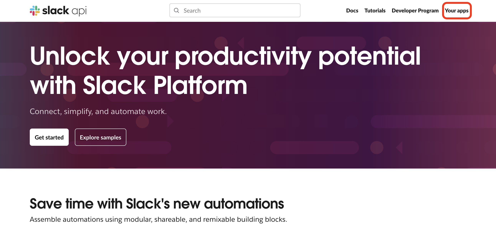

3. “Create New App”을 클릭합니다.
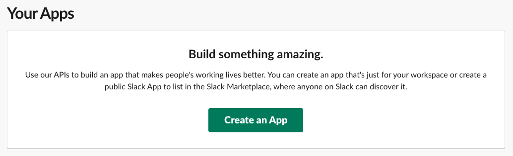

"From Scratch"를 선택한 후, App Name에 챗봇의 이름을 지정해줍니다. (나중에 변경 가능합니다)
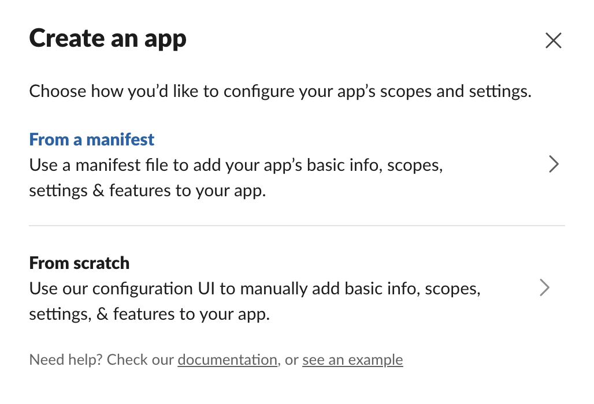

Create App을 클릭합니다.
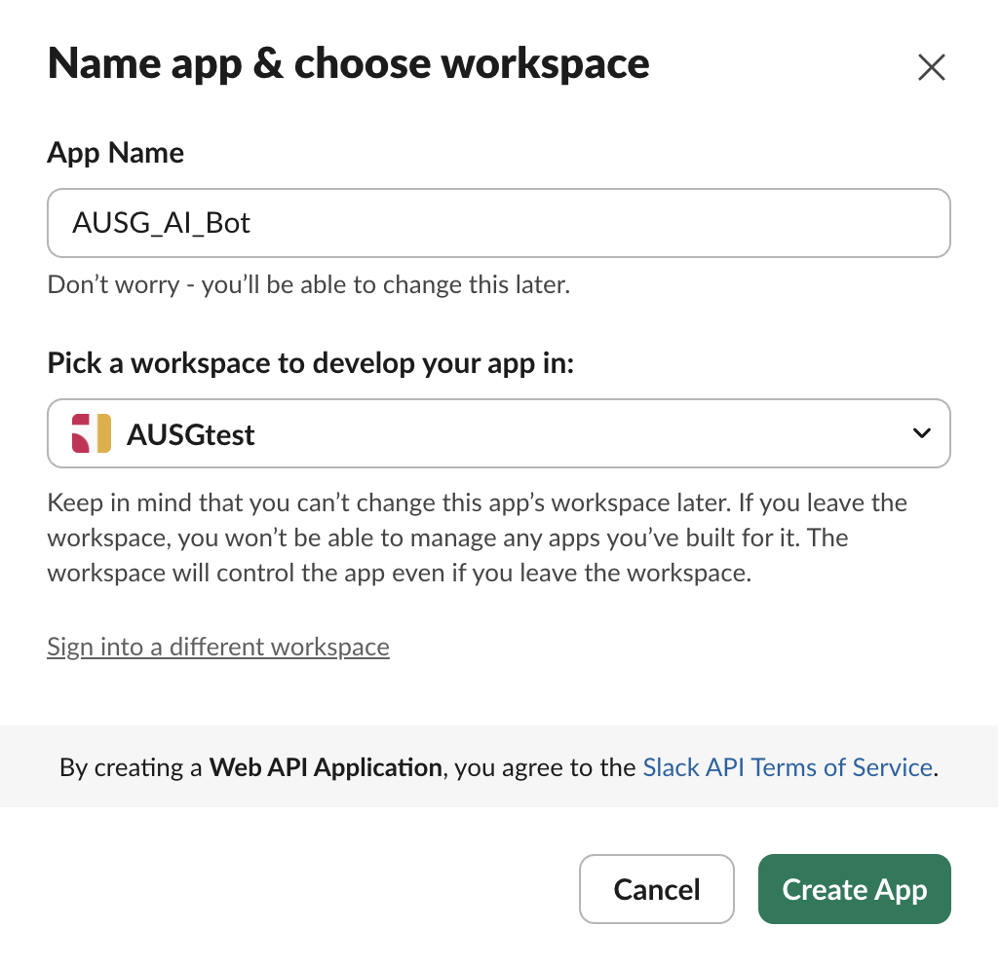


### STEP3 Lambda 함수 생성하기
이제 챗봇의 두뇌 역할을 할 Lambda 함수를 만들어봅시다.
AWS 콘솔에서 [Lambda(또는 여기를 클릭)](https://us-west-2.console.aws.amazon.com/lambda/home?region=us-west-2#/functions) 검색 후 **함수 생성**을 클릭합니다.
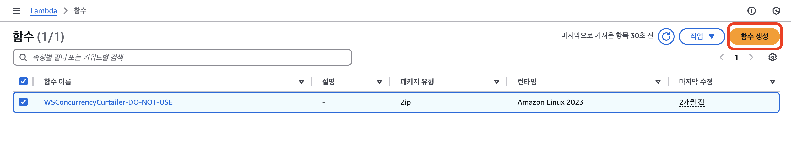
다음과 같이 설정해줍니다:
   - 함수 이름: SlackAIResponder
   - 런타임: Python 3.10
   - 아키텍처: x86_64
설정을 마친 후 함수 생성을 클릭합니다.
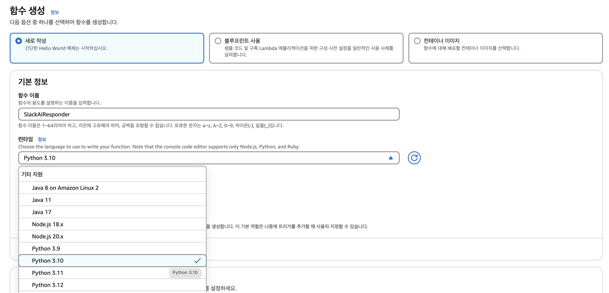


코드 소스 섹션에 다음 코드를 붙여넣어줍니다:

```
import json
import boto3
import urllib3

# 초기화
http = urllib3.PoolManager()
bedrock_client = boto3.client('bedrock-agent-runtime', region_name='**us-west-2**') # 본인이 환경을 구성한 Region으로 변경

def lambda_handler(event, context):
    try:
        question = event.get('question')
        response_url = event.get('response_url')

        # Bedrock 호출
        response = bedrock_client.retrieve_and_generate(
            input={'text': question},
            retrieveAndGenerateConfiguration={
                'type': 'KNOWLEDGE_BASE',
                'knowledgeBaseConfiguration': {
                    'knowledgeBaseId': '**ABCDEF1G2**', # 본인의 KnowledgeBase Id 로 변경
                    'modelArn': 'arn:aws:bedrock:**us-west-2**::foundation-model/anthropic.claude-3-5-sonnet-20240620-v1:0'
                }                               
            }
        )
        
        # 응답 처리
        ai_response = response.get('output', '응답을 생성할 수 없습니다.')
        if isinstance(ai_response, dict) and 'text' in ai_response:
            ai_response = ai_response['text']
        
        # Slack으로 응답 전송
        http.request(
            'POST',
            response_url,
            body=json.dumps({
                "response_type": "in_channel",
                "text": f"*답변:*\n{ai_response}"
            }).encode('utf-8'),
            headers={'Content-Type': 'application/json'},
            timeout=5.0
        )

        return {"statusCode": 200}

    except Exception as e:
        return {"statusCode": 500}

```

이때  주의할 점은 본인이 생성한 [Bedrock 지식 기반](https://us-west-2.console.aws.amazon.com/bedrock/home?region=us-west-2#/knowledge-bases)의 ID로 코드 내 ID를 변경해주어야 합니다.

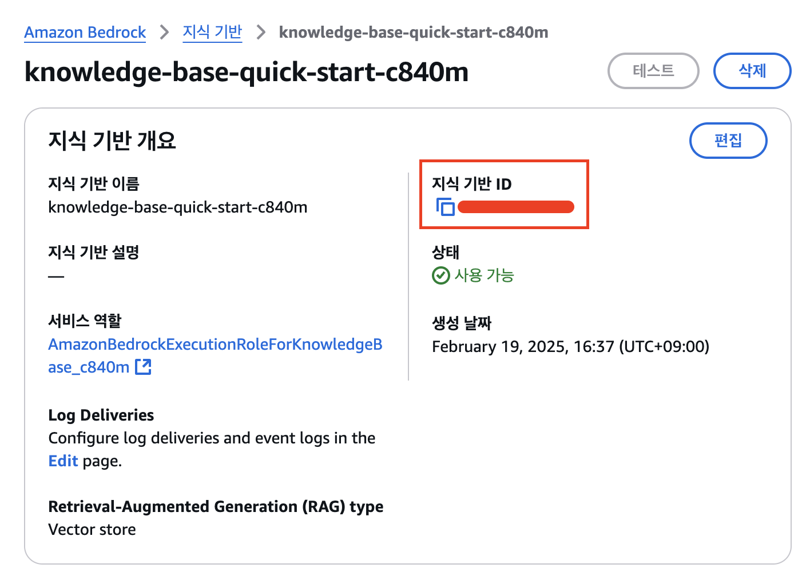
다시 [SlackAIResponder 람다 함수](https://us-west-2.console.aws.amazon.com/lambda/home?region=us-west-2#/functions)로 돌아와서 **구성 > 편집**을 클릭해줍니다.
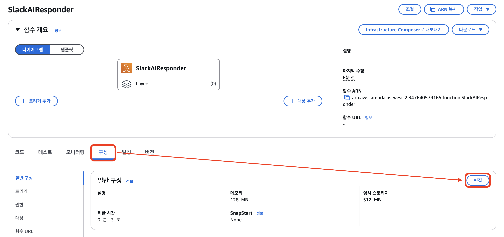

제한시간을 **1분**으로 변경한 후 저장해줍니다.(AI 모델이 응답하는데 충분한 시간이 필요하기 때문입니다.)
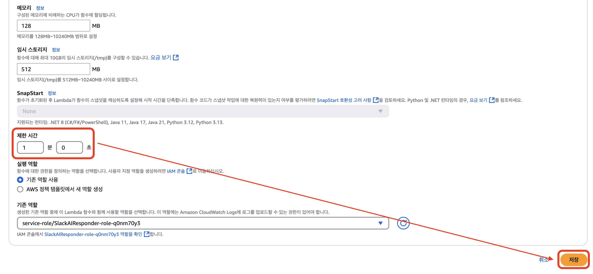

이제 Lambda 함수에 필요한 권한을 설정해봅시다. **구성**에서 **권한 > 역할** 이름의 링크를 클릭합니다.
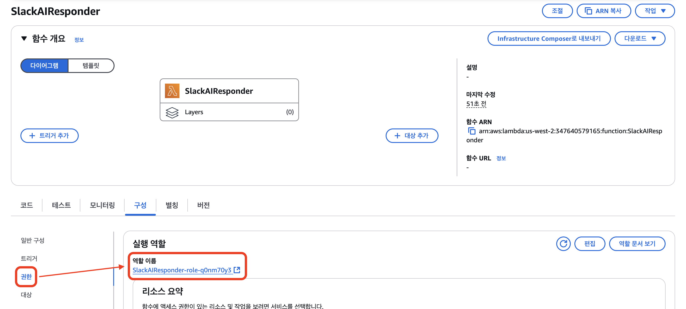

**권한 추가 > 정책 연결**을 클릭하여 새로운 권한을 추가해줍니다.
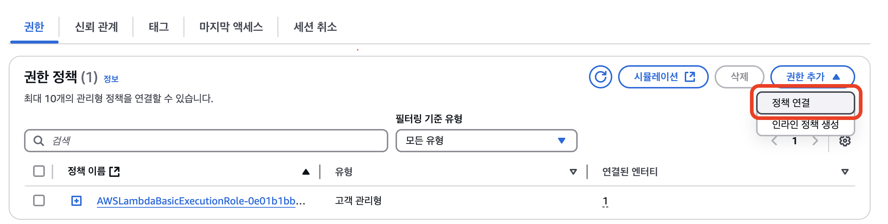

검색창에서 **AmazonBedrockFullAccess** 검색 후 권한을 추가해줍니다.
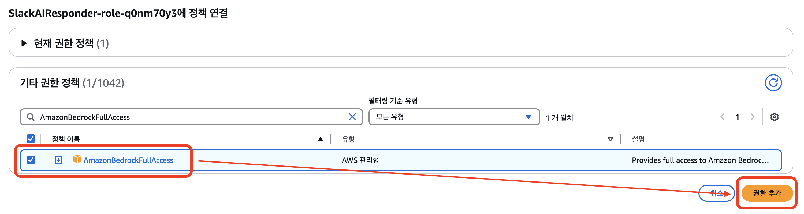

이제 두 번째 Lambda 함수를 만들어볼 차례입니다. 

다시 [Lambda 콘솔](https://us-west-2.console.aws.amazon.com/lambda/home?region=us-west-2#/functions)로 돌아와서 두번째 람다함수 **SlackInitialResponder** 함수를 생성해줍니다.
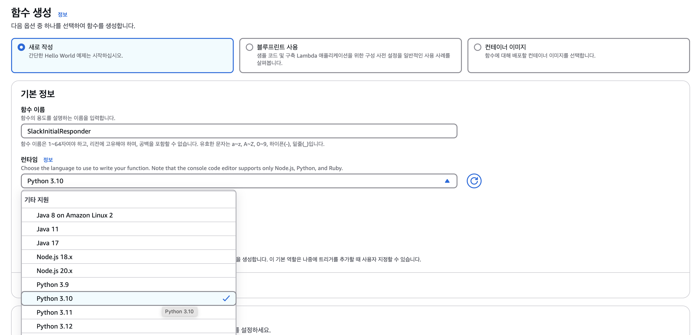
다음 설정으로 함수를 생성합니다:
   - 함수 이름: SlackInitialResponder
   - 런타임: Python 3.10
   - 아키텍처: x86_64
설정을 마친 후 함수 생성을 클릭합니다.

코드 소스 섹션에 다음 코드를 붙여넣어줍니다:


```
import json
import boto3
import base64
from urllib.parse import parse_qs

# Lambda 클라이언트 초기화
lambda_client = boto3.client('lambda')

def lambda_handler(event, context):
    try:
        # Base64 디코딩
        if event.get('isBase64Encoded', False):
            body_str = base64.b64decode(event['body']).decode('utf-8')
        else:
            body_str = event.get('body', '')
        
        # URL 디코딩 및 파싱
        body = parse_qs(body_str)
        
        # 텍스트와 response_url 추출
        text = body.get('text', [''])[0]
        response_url = body.get('response_url', [''])[0]

        if not text:
            return {
                "statusCode": 200,
                "headers": {"Content-Type": "application/json"},
                "body": json.dumps({
                    "response_type": "ephemeral",
                    "text": "질문을 입력해주세요. 예: /ask 테스트"
                })
            }

        # SlackAIResponder로 전달할 payload
        payload = {
            'question': text,
            'response_url': response_url
        }

        # SlackAIResponder 호출
        lambda_client.invoke(
            FunctionName='**SlackAIResponder**', # 본인이 설정한 Lambda Function 이름으로 변경
            InvocationType='Event',
            Payload=json.dumps(payload)
        )

        return {
            "statusCode": 200,
            "headers": {"Content-Type": "application/json"},
            "body": json.dumps({
                "response_type": "in_channel",
                "text": f"'{text}' 에 대한 답변을 생성하고 있습니다..."
            })
        }

    except Exception as e:
        return {
            "statusCode": 200,
            "headers": {"Content-Type": "application/json"},
            "body": json.dumps({
                "response_type": "ephemeral",
                "text": "요청 처리 중 오류가 발생했습니다."
            })
        }
```

이제 SlackInitialResponder에도 필요한 권한을 설정해줘야 합니다. SlackInitialResponder 람다함수도 동일하게 **구성 > 권한 > 역할 이름 링크**를 클릭합니다.
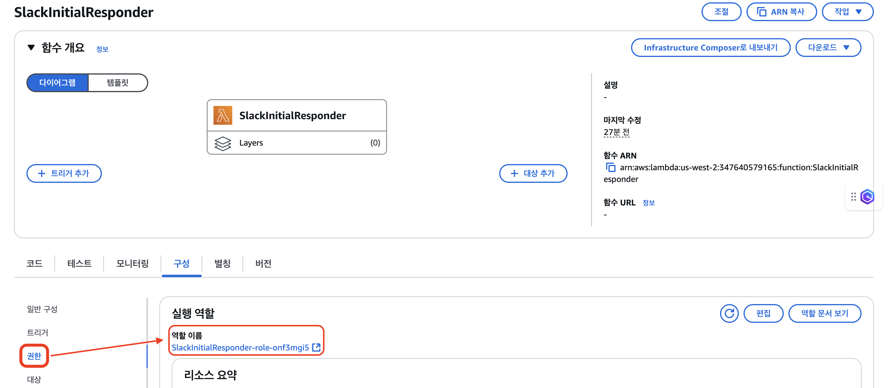

이번에는 **인라인 정책 생성**을 클릭합니다. 이는 SlackAIResponder Lambda를 호출하기 위해 필요한 권한입니다.
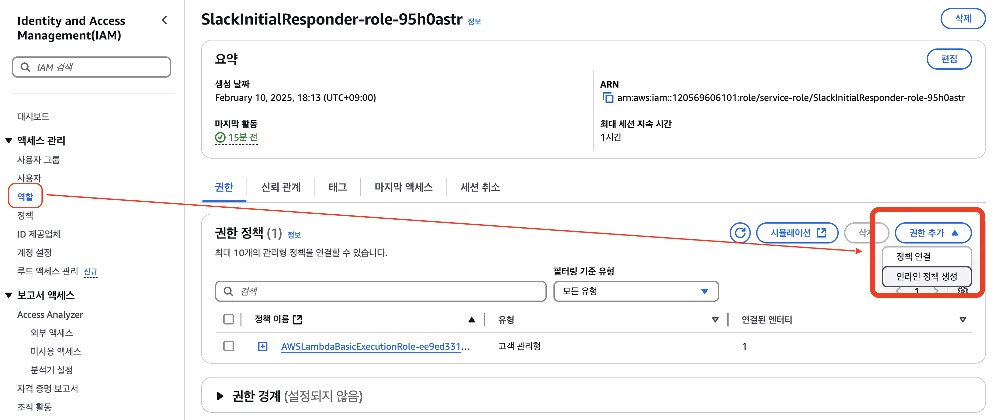

JSON을 클릭한 후 다음 코드를 붙여넣어줍니다:

```
{
    "Version": "2012-10-17",
    "Statement": [
        {
            "Effect": "Allow",
            "Action": [
                "lambda:InvokeFunction"
            ],
            "Resource": "*"
        },
        {
            "Effect": "Allow",
            "Action": [
                "logs:CreateLogGroup",
                "logs:CreateLogStream",
                "logs:PutLogEvents"
            ],
            "Resource": "*"
        }
    ]
}
```
<!-- 여기 사진이 비어있음  -->
'다음'을 클릭한 후, 정책 이름을 "SlackAIResponderInvoke"로 입력하고 '정책 생성'을 클릭합니다.


### STEP4 API Gateway 설정하기
이제 Slack과 우리의 Lambda 함수를 연결해줄 API Gateway를 설정해봅시다.

AWS console에서 [API Gateway 콘솔](https://us-west-2.console.aws.amazon.com/apigateway/main/apis?region=us-west-2#)에 접속한 후 'HTTP API 구축'을 클릭합니다.
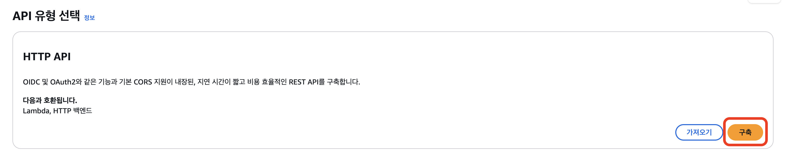
API 이름을 입력하고(예: AUSG_API) 나머지 단계는 모두 기본값으로 둔 채 다음으로 넘어갑니다.

이제 API에 대한 경로를 생성해봅시다. 좌측 메뉴의 'Routes'를 클릭 > 방금 만든 API에 대한 경로 생성을 클릭합니다.
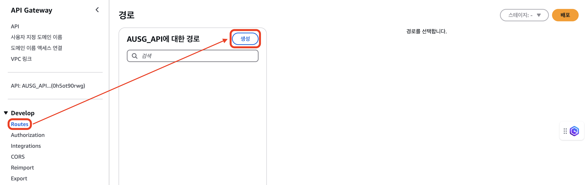

**POST** 방식으로 경로를 생성해줍니다.
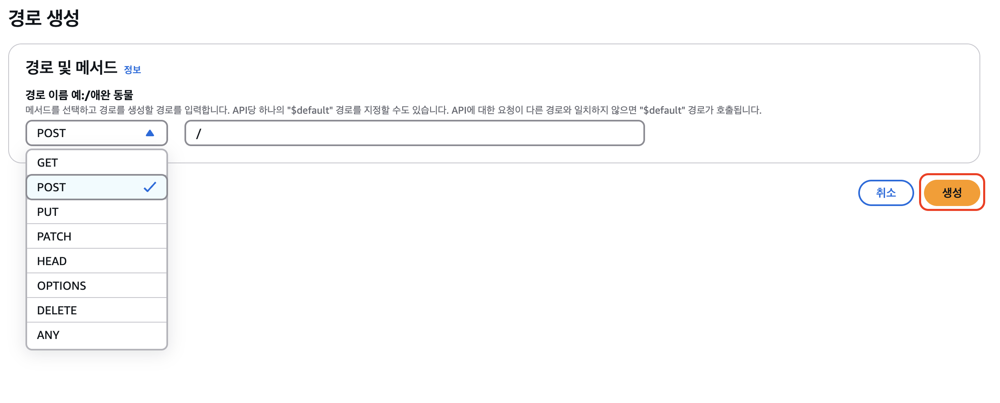

**통합 연결** 클릭한 후 '통합 생성 및 연결'을 선택합니다.
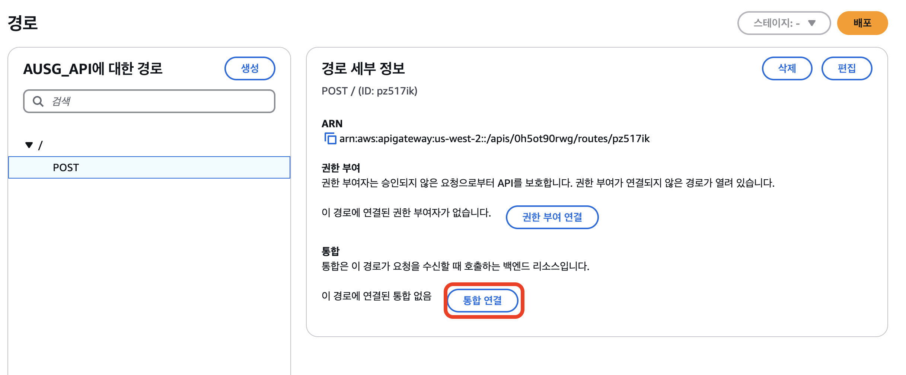

통합 유형을 Lambda 함수로 **설정 >앞서 만든 SlackInitialResponder 함수 선택 > 생성** 을 클릭 해줍니다.
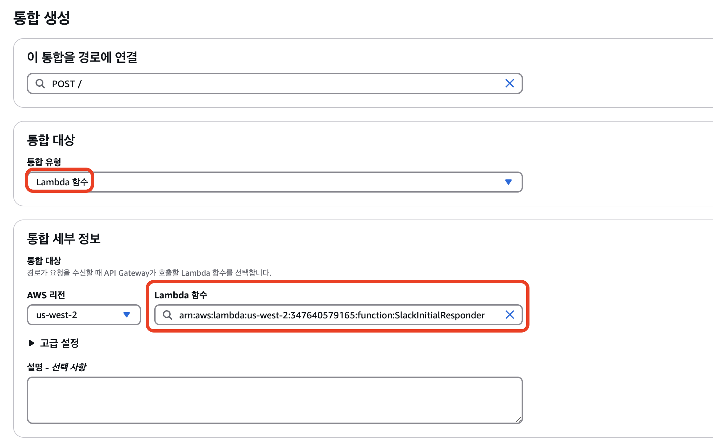

생성이 완료되면 API의 기본 엔드포인트를 복사해둡니다. 이는 Slack 앱 설정에서 사용할 예정입니다.
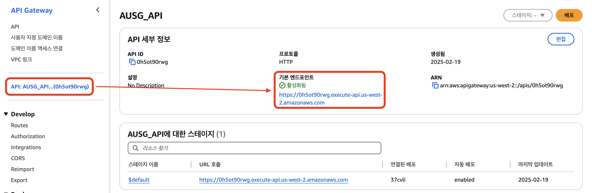

### STEP 5 Slack 앱 설정 마무리하기
다시 Slack API 페이지로 돌아와서 앱의 권한을 설정해봅시다.
좌측 사이드 메뉴에서 **OAuth & Permissions**를 클릭합니다.
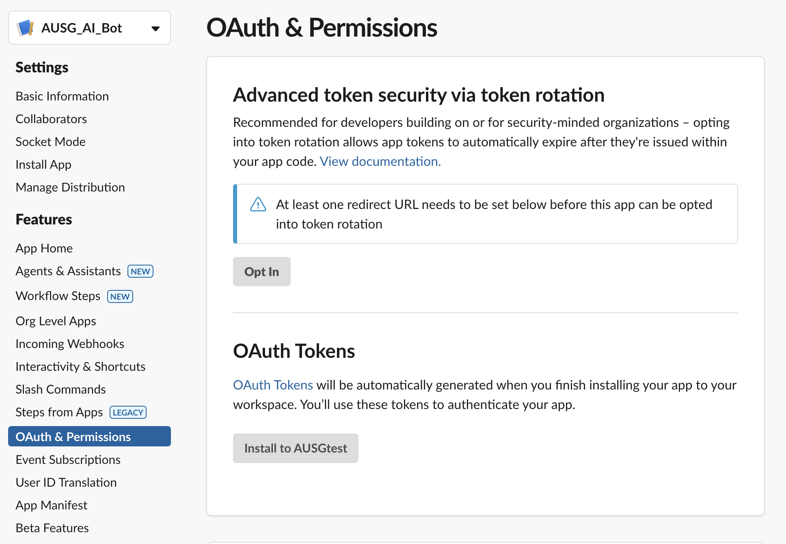

아래의 Redirect URLs 섹션에서 앞서 복사한 API Gateway 엔드포인트를 붙여넣고 저장합니다.
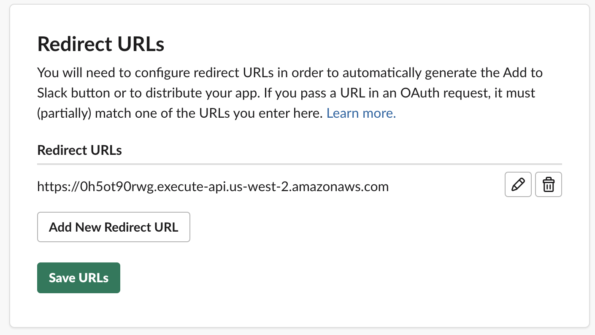

이제 봇이 필요로 하는 권한들을 추가해봅시다. 

Scopes 섹션에서 **Bot Token Scopes**의 **Add an OAuth Scope** 버튼을 클릭하여 다음 권한들을 추가합니다:
* commands - 사용할 수 있는 단축키 및/또는 슬래시 명령 추가
* conversations.connect:read
* groups:read
* im:read
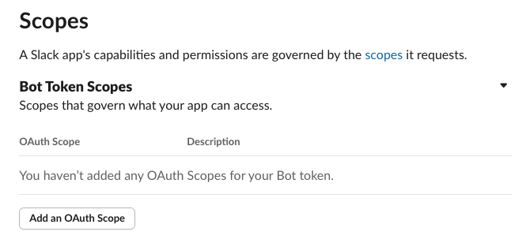

같은 페이지의 OAuth Tokens에서 **Install to 내 워크플레이스 이름** > Allow 선택하여 앱을 워크스페이스에 설치합니다.
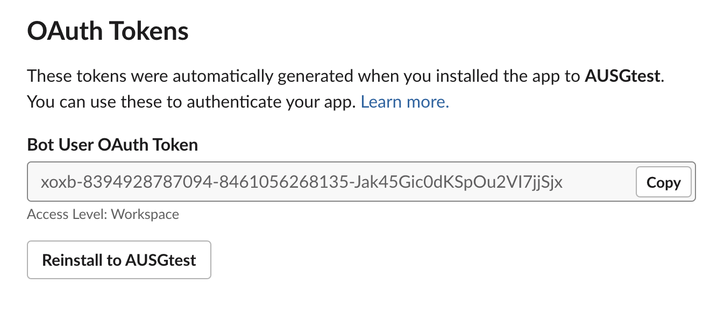

### STEP 6 슬래시 명령어 설정하기
마지막으로, 챗봇을 호출할 슬래시 명령어를 설정해봅시다.

Slash Commands 클릭 > Create New Command 를 선택합니다.
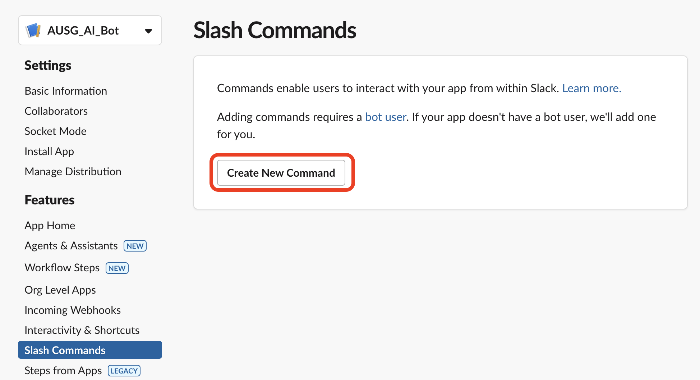

다음 정보들을 입력합니다:
- Command : ai를 호출할 명령어 입력
- Request URL : API Gateway 엔드포인트 입력
- (Optional) Short Description : 명령어 입력시 뜰 설명 입력
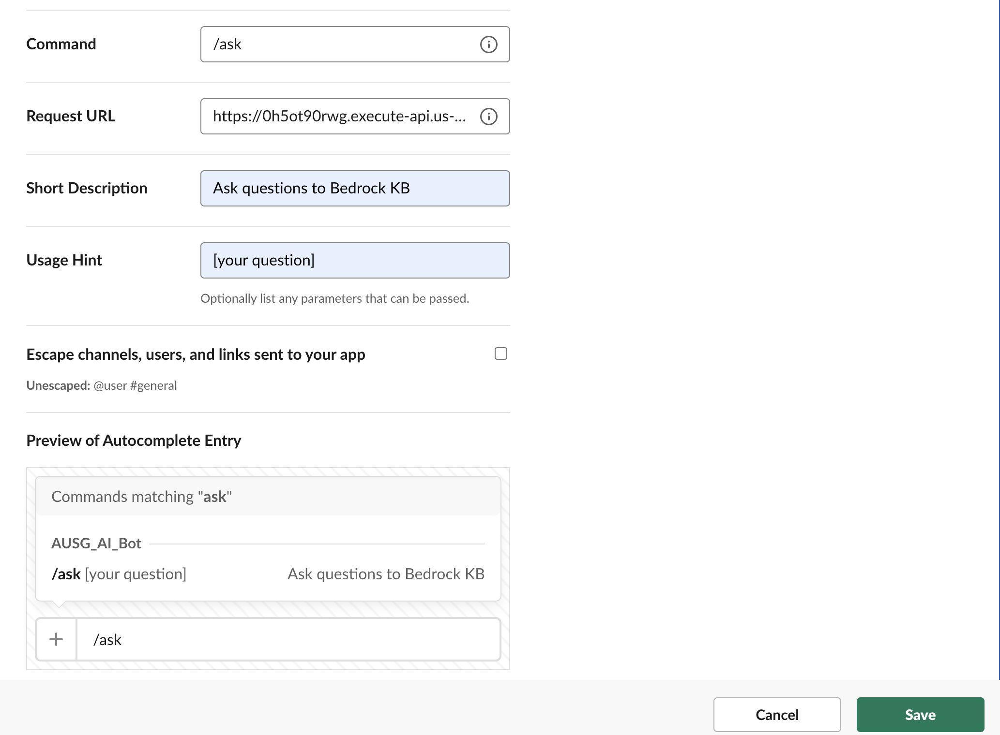

이것으로 모든 설정이 완료되었습니다!

이제 Slack 워크스페이스에서 설정한 슬래시 명령어를 통해 Knowledge Base를 활용한 AI 챗봇과 대화를 나눌 수 있습니다.

예를 들어, /ask 안녕하세요와 같이 입력하시면 챗봇이 Knowledge Base를 기반으로 답변을 제공할 것입니다.

문제가 발생하면 Lambda 함수의 CloudWatch 로그를 확인하여 디버깅하실 수 있습니다.


